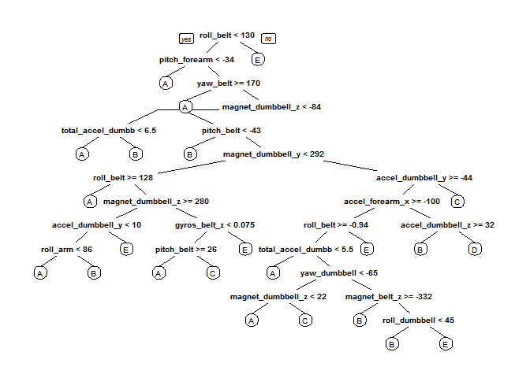

# Practical Machine Learning Project - Quantified Self Movement Data Analysis Report
John Brennan (London Town)  
22nd November 2015  
#Introduction

Using devices such as Jawbone Up, Nike FuelBand, and Fitbit it is now possible to collect a large amount of data about personal activity relatively inexpensively. These type of devices are part of the quantified self-movement - a group of enthusiasts who take measurements about themselves regularly to improve their health, to find patterns in their behavior, or because they are tech geeks. One thing that people regularly do is quantify how much of a particular activity they do, but they rarely quantify how well they do it.

In this project, I will use data from accelerometers on the belt, forearm, arm, and dumbbell. Six young health participants were asked to perform one set of 10 repetitions of the Unilateral Dumbbell Biceps Curl in five different fashions: exactly according to the specification

1.	Class A: exactly according to the correct specification
2.  Class B: throwing the elbows to the front
3.	Class C: lifting the dumbbell only halfway
4.	Class D: lowering the dumbbell only halfway
5.	Class E: throwing the hips to the front

**Class A corresponds to the correct specified execution of the exercise, while the other four classes correspond to common mistakes.**


```r
    library(caret)
```

```
## Loading required package: lattice
## Loading required package: ggplot2
```

```r
    library(rpart)
    library(rpart.plot)
    library(randomForest)
```

```
## randomForest 4.6-12
## Type rfNews() to see new features/changes/bug fixes.
```

```r
    library(dplyr) 
```

```
## 
## Attaching package: 'dplyr'
## 
## The following object is masked from 'package:randomForest':
## 
##     combine
## 
## The following objects are masked from 'package:stats':
## 
##     filter, lag
## 
## The following objects are masked from 'package:base':
## 
##     intersect, setdiff, setequal, union
```
# Exploratory Analysis and Data Cleaning.
    I carried out a great deal o exploratory data analysis not all detailed here. I selected 52 predictors from the 160 variables supplied in the input data. These are clearly listed below as part of the 'dplyr' 'select' option. Each line contains a set of four similar pieces of data coming from the four different sensors. Some of the fields were irrelevant to this investigation and many of supplied fields contained largely missing data. These were excluded from the investigation to save time. Grouping like data together in the new data frame (pract_03) did take some effort. My intention was to use multiple regression analysis on these like pieces of data but did not pursue this approach in the end.
    

```r
     pract_02 <- read.csv('pml-training.csv')
     print(dim(pract_02))
```

```
## [1] 19622   160
```

```r
     pract_03 <- select( pract_02,
                        classe,
accel_arm_z,      accel_belt_z,     accel_dumbbell_z,     accel_forearm_z, 
gyros_arm_z,      gyros_belt_z,     gyros_dumbbell_z,     gyros_forearm_z,
magnet_arm_z,     magnet_belt_z,    magnet_dumbbell_z,    magnet_forearm_z,
accel_arm_y,      accel_belt_y,     accel_dumbbell_y,     accel_forearm_y,
gyros_arm_y,      gyros_belt_y,     gyros_dumbbell_y,     gyros_forearm_y,
magnet_arm_y,     magnet_belt_y,    magnet_dumbbell_y,    magnet_forearm_y,
accel_arm_x,      accel_belt_x,     accel_dumbbell_x,     accel_forearm_x,
gyros_arm_x,      gyros_belt_x,     gyros_dumbbell_x,     gyros_forearm_x,
magnet_arm_x,     magnet_belt_x,    magnet_dumbbell_x,    magnet_forearm_x,
pitch_arm,        pitch_belt,       pitch_dumbbell,       pitch_forearm,
roll_arm,         roll_belt,        roll_dumbbell,        roll_forearm, 
total_accel_arm,  total_accel_belt, total_accel_dumbbell, total_accel_forearm,
yaw_arm,          yaw_belt,         yaw_dumbbell,         yaw_forearm)
```
### I had a problem with the 'classe' field that I resolved in this somewhat cumbersome fashion.


```r
    classe_01    <- select(pract_03, classe)
    pract_04     <- pract_03 [, sapply(pract_03,  is.numeric)]
    classe_01[]  <- lapply(classe_01, as.character)
    pract_05     <- cbind(classe_01, pract_04)
```
### This was used to speed up the testing process.


```r
    #pract_06 <- sample_n(pract_05, 5000)
```

#Slice the data

I split the cleaned training set into a pure training data set (68%) and a validation data set (32%). I will use the validation data set to carry out cross validation later.


```r
    inTrain <- createDataPartition(y=pract_05$classe, p=0.68, list=FALSE)
    
    training <- pract_05[inTrain,]
    testing  <- pract_05[-inTrain,]
```
#Data Modeling

    After some exploration I decided to use an Random Forest algorithm as it automatically selects important variables and is robust to correlated covariates & outliers. I dedided to use a 5-fold cross validation when applying the algorithm.
    

```r
    set.seed(27061957)

    Ctrl_Rf <- trainControl(method="cv", 5)

    modelRf <- train(classe ~ ., 
                     data=training,
                     method="rf",
                     trControl=Ctrl_Rf, 
                     ntree=250)

    print(modelRf)
```

```
## Random Forest 
## 
## 13344 samples
##    52 predictor
##     5 classes: 'A', 'B', 'C', 'D', 'E' 
## 
## No pre-processing
## Resampling: Cross-Validated (5 fold) 
## Summary of sample sizes: 10676, 10675, 10675, 10676, 10674 
## Resampling results across tuning parameters:
## 
##   mtry  Accuracy   Kappa      Accuracy SD  Kappa SD   
##    2    0.9904827  0.9879600  0.002576710  0.003259443
##   27    0.9892084  0.9863475  0.002547264  0.003222877
##   52    0.9844871  0.9803745  0.003899874  0.004934391
## 
## Accuracy was used to select the optimal model using  the largest value.
## The final value used for the model was mtry = 2.
```
# Estimating the performance of the model.
    Test the model against the test data (32% of the original data).
    The Appendix contains the relevant 'tree model'.
    

```r
    predictRf <- predict(modelRf, testing)
    confusionMatrix(testing$classe, predictRf)
```

```
## Confusion Matrix and Statistics
## 
##           Reference
## Prediction    A    B    C    D    E
##          A 1785    0    0    0    0
##          B   12 1200    3    0    0
##          C    0   12 1079    4    0
##          D    0    0   16 1012    1
##          E    0    0    0    3 1151
## 
## Overall Statistics
##                                           
##                Accuracy : 0.9919          
##                  95% CI : (0.9893, 0.9939)
##     No Information Rate : 0.2862          
##     P-Value [Acc > NIR] : < 2.2e-16       
##                                           
##                   Kappa : 0.9897          
##  Mcnemar's Test P-Value : NA              
## 
## Statistics by Class:
## 
##                      Class: A Class: B Class: C Class: D Class: E
## Sensitivity            0.9933   0.9901   0.9827   0.9931   0.9991
## Specificity            1.0000   0.9970   0.9969   0.9968   0.9994
## Pos Pred Value         1.0000   0.9877   0.9854   0.9835   0.9974
## Neg Pred Value         0.9973   0.9976   0.9963   0.9987   0.9998
## Prevalence             0.2862   0.1931   0.1749   0.1623   0.1835
## Detection Rate         0.2843   0.1911   0.1719   0.1612   0.1833
## Detection Prevalence   0.2843   0.1935   0.1744   0.1639   0.1838
## Balanced Accuracy      0.9967   0.9936   0.9898   0.9949   0.9993
```
# Run the model against the 'assignment test data' for later submission to Coursera.


```r
    out_of_sample_error <- 1 - as.numeric(confusionMatrix(testing$classe, predictRf)$overall[1])
    print(out_of_sample_error)
```

```
## [1] 0.008123606
```
#So, the estimated accuracy of the model is 98.95% and the estimated out-of-sample error is 1.05%.

```r
    test_02 <- read.csv('test_02.csv')
    #View(test_02)
    
    result <- predict(modelRf, test_02[, -length(names(test_02))])
    print(result)
```

```
##  [1] B A B A A E D B A A B C B A E E A B B B
## Levels: A B C D E
```
# Appendix


```r
    treeModel <- rpart(classe ~ ., data=training, method="class")
    prp(treeModel) # fast plot
```

 

